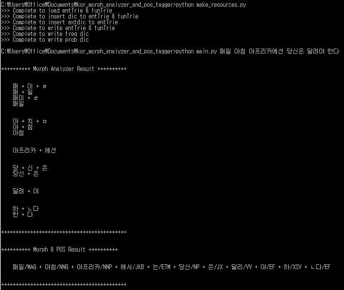

# 한국어 형태소 분석기와 품사 태거 (Korean Mophological Analysis and Part Of Speech (POS) Tagger)
결합규칙, 엔트리사전 등의 언어자원을 사용해 규칙기반의 형태소 분석기를, 세종코퍼스로부터 얻은 통계정보를 사용해 기계학습기반(HMM/Viterbi) 품사 태거를 만들었다. 형태소 분석과 품사 태깅 개념 및 관련 내용은 [여기](https://github.com/gritmind/review-media/blob/master/class/natural-language-processing-chungnam/README.md)에서 확인할 수 있다. 또한, [jupyter notebook](https://github.com/gritmind/morph_and_pos_analyzer_korean/tree/master/jupyter_notebooks)을 참고하면 알고리즘 단계별로 출력 결과를 확인할 수 있다. 

  * 교착어인 한국어 형태소 분석을 위해 규칙과 언어자원을 활용한 형태소 분석기 구현
      - 엔트리 사전, 형태 변형 규칙, 결합 규칙과 같은 도메인 지식 활용
      - 효율적인 엔트리 저장을 위한 Trie 자료 구조 구현
      - 형태소 조합을 위한 Recursion 구현
  * 언어 분석과 형태소 조합의 중의성 해결을 위해 Hidden Markov 모델 기반 품사 태거 구현
      - Bayes 규칙, Markov 특성, Independence 가정 기반의 확률 모델 정의
      - 세종 코퍼스로부터 전이확률, 출력확률 추정
      - 효율적인 시퀀스 계산을 위한 Viterbi 알고리즘(dynamic programming) 구현


프로젝트에 대한 PPT 발표자료는 [여기](https://1drv.ms/p/s!AllPqyV9kKUrklgL_fo6D6U3FLwV)에서 확인할 수 있다.

## Model Description
### 1. 형태소 분석기 (사전/규칙기반 모델)
* **Lexicon**: 엔트리(체언,용언)사전 / 기능어(조사,어미)사전 (불규칙 사전 구축과 결합규칙을 위한 inflection정보포함, 결합규칙을 위한 POS정보포함) 
* **Morphotactics**: 형태소 결합 규칙 리스트 (ex. 엔트리+기능어, 엔트리+엔트리)
* **Orthographic rules**: 형태소 확장 사전 구축에 필요한 불규칙 변형 리스트 (하나의 stem에서 변하는 단어들이 많음)
* 한국어 특성에 맞게 검색 및 저장을 효율적으로 하기 위해 **trie 자료구조**를 사용해 사전을 구축
* 사전과 결합규칙에 맞는 모든 경우의 수의 형태소 조합들을 출력 
* 최적의 형태소 조합을 찾는 일은 품사 태깅과 함께 확률적으로 선택

### 2. 품사 태거 (corpus기반 HMM (Hidden Markov Model) 확률 모델)
* 조건부 확률 (태그|단어) 모델링으로 단어에 대한 태그 예측
* 확률을 count-base로 corpus로부터 inference하기 위해 bayes rule과 markov assumption 사용
* 수많은 sequence 조합을 계산하기 위해 (중복된 계산을 피하기 위) dynamic programming (i.e. **viterbi algorithm**) 사용
* 영어와 달리 형태소 조합이 여러개 있는 한국어 특성상 품사 태깅에서 태깅과 동시에 가장 좋은 형태소 조합을 선택

## Prerequisites
* python 3.5
* hangul-utils 0.2
* beautifulsoup4 4.5.1

## Dataset
세종코퍼스 [다운로드](https://drive.google.com/open?id=0By4RRGJEeCR5OFo4NHdrZkdMNkE) [출처:국립언어원-언어정보나눔터]

## Usage
```
python make_resources.py
```
* 엑셀파일로부터 trie기반 엔트리/기능어 lookup table 생성
* 세종코퍼스로부터 smoothing된 pos전이확률, pos로부터word출력확률 lookup table 생성 
* (주의) 세종코퍼스 수정필요: 'ᆫ'을 'ㄴ'으로 그리고 'ᆯ'를 'ㄹ'로 고쳐야함.
```
python main.py 매일 아침 아프리카에선 당신은 달려야 한다
```
* 분석하고 싶은 문장을 인자로 main 함수를 실행한다.

#### Example


## Limitation
* 입력의 문법적인 오류는 없다고 가정하고 오로지 한글만 가능 (숫자, 콤마 등은 x)
* Light한 엔트리/기능어 사전때문에 많은 단어들을 커버하지 못함 (오류: assert(fullpath_check == True))
* 형태소 분석기 TERMINABLE 처리 하지 않음 (ex. 어/EC, 아/EC 생략)
* 알고리즘 최적화를 실시하지 않음 (속도문제 발생)

## Futher Study
* 제한사항 보완
* 형태소 분석기 보완
   * 오타처리
   * 띄어쓰기 오류처리
   * 신조어처리

## Summary
_구현부분_
* 형태소 분석기
   * 중복된 element가 많은 한글어를 효율적으로 저장하기 위해 trie 자료구조 구현 
   * 형태소 분서기에서 교착어 특징을 가지는 한글에서 확장 사전을 어떻게 구축하느냐가 중요 (어근이 변하는 일련의 패턴을 코딩으로 자동화)
   * index가 있는 entry들을 모든 조합의 sequence들로 출력 (recursive함수 사용)
   * 이외에 각종 리스트 데이터 처리 (전처리 등)
* 품사 태거
   * 품사태거를 위해 HMM 모델 (세종코퍼스로부터 전이확률, 출력확률 추정) 구현
   * HMM 모델의 decoding을 위해 dynamic programming (Viterbi 알고리즘) 구현

_개념부분_
* 한글은 조립식컴퓨터처럼 (또는 레고처럼) 의미를 완성하기까지 접사를 계속해서 붙여나가는 식이지만 영어는 완제품컴퓨터처럼 아예 형태적으로 모두 다르다. 
   * ex. '먹-', '먹었-', '먹었었-', '먹었겠-', ...  ; 'have', 'has', 'had' 
   * 따라서 영어에서 형태소 분석이 크게 중요하지 않다. 대부분 형태가 다르므로 그냥 tokenization을 해주면 된다.
   * 반면 한글은 위와 같은 레고블럭을 잘 쪼개주는 정교한? 작업이 필요하다.
* 사전/규칙기반 형태소 분석기 3요소: (1) 사전, (2) 결합규칙, (3) (결합후) 형태변화인지 & 원형복원 
   * (3)을 하기 위해 동사/형용사 대상으로 확장사전을 구축한다.
* 형태소 분석의 결과는 모든 경우의 조합들을 포함한다. 하나의 베스트 조합을 찾는 중의성 문제는 품사태거가 같이 해결해준다.
* HMM 모델에서 확률을 쉽게 inference하기 위해서 bayesian inference와 markov assumption 사용한다. (만약 데이터가 무한으로 있으면 위와 같은 트릭들을 사용안해도됨.)
* viterbi 알고리즘은 각 time step마다 전 time step만 봐서 optimal path만 table로 저장해놓는게 핵심이다. 이는 중복계산을 피하기 위함이고 table에 모두 저장하면 decoding할 때 한 번에 best sequence를 찾을 수 있다.

## Acknowledgement
충남대학교, 자연어처리


